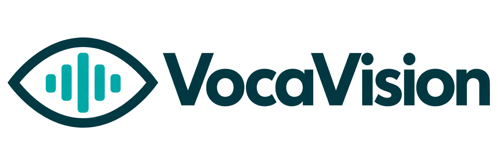

<p align="center">
  
</p>

<p align="center">
  A live video call with an assistant that tells blind iPhone users what the camera sees, in their own dialect.
</p>

<p align="center">
  
  
  
  
</p>

---

VocaVision turns the phone into a pair of eyes you can talk to. You start a call, point the camera at something, and **Voca** answers by voice: what is on the table, what the sign says, which row is highlighted in a BIOS menu. Ask her to keep watching and she reports changes as they happen instead of waiting to be asked.

It is built for people who use VoiceOver all day. Every control is labelled in Arabic and English, nothing depends on seeing the screen, and the call itself is a real system call (LiveCommunicationKit), so it survives the lock screen and shows up in the phone's call UI.

The app talks directly to Google's Gemini Live API with a key you paste in once. There is no backend, no account, no analytics. Your audio and camera frames go to Google and nowhere else, and the code that sends them is all in this repository.

## Features

- **Conversation.** Talk naturally, interrupt mid-sentence, get answers about what the camera is looking at right now. The model receives the camera as a live video stream, not a snapshot taken when you ask.
- **Watch mode.** Say "راقب الشاشة" (watch the screen) and Voca reads each menu row as the highlight moves, announces page changes, and describes a new scene when you re-aim the phone. She stays quiet when nothing changed.
- **Your dialect, locked.** 71 languages and 128 regional variants, including 20 Arabic dialects with hand-written guidance for each. The assistant does not drift into Modern Standard Arabic because you paused.
- **30 voices from Google's directory.** The list, the one-word characteristics, the gender labels and the sample recordings are loaded from Google's own published tables, so new voices appear without an app update.
- **Presets and profile.** General narrator, BIOS and system-menu navigator, document reader, object identifier, or your own prompt; the assistant knows your name and addresses you with the right grammatical gender.
- **Barge-in that survives speakerphone.** Echo-aware gating lets you interrupt Voca while she is talking through the speaker without her hearing herself.
- **Liquid Glass UI on iOS 26.** Floating glass controls over the camera preview, with the whole call screen usable from the VoiceOver rotor.

## How it works

### The call

`CallSessionController` registers the call with LiveCommunicationKit and hands audio to `CallAudioEngine` only after the system activates the session. The engine runs AVAudioEngine with voice processing (echo cancellation, noise suppression, gain control). Microphone audio is converted to 16 kHz PCM in 40 ms chunks and streamed up; model audio comes back as 24 kHz PCM and is played through an `AVAudioSourceNode` that pulls from a lock-free ring buffer (`PlaybackRingBuffer`).

The ring buffer is there for a reason. Scheduling model audio through `AVAudioPlayerNode` buffers produced audible gaps whenever a chunk arrived late; a source node with a 120 ms pre-roll that renders silence on underrun and flushes instantly on interruption does not.

### Live video

`SpeechFeedbackOrchestrator` streams JPEG frames (longest side 768 px) for the whole call: one per second in watch mode, one every two seconds otherwise, plus one the instant you start speaking. That is the API's video mode; Gemini Live caps video at 1 fps and, on Gemini 3.1, folds every frame since the last turn into the next one (`TURN_INCLUDES_AUDIO_ACTIVITY_AND_ALL_VIDEO`). So when you ask "what is this?", the model already has the last few seconds of what you were pointing at.

### Watch mode

Google is explicit that video frames never start a model turn on their own; something has to prompt the model. Their documented answer, which VocaVision follows, is a heartbeat: send the latest frame, then a short text ping asking the model to inspect the scene and decide.

VocaVision's ping is a private message starting with `[WATCH]`. The system prompt forbids reading it aloud, and if the output transcript ever contains one, playback is cut. The model has two ways to answer a ping: say what changed in one sentence, or call the `nothing_changed` tool, which is silent. Pings are only sent after the previous turn completed and when nobody is talking; a ping during generation would cancel it.

What decides *when* to ping is on the phone:

- **Re-aim.** `MotionService` watches rotation rate and user acceleration from Core Motion. When the phone moves and then settles for half a second, the model is asked to describe the new view.
- **Scene change.** `SceneChangeDetector` keeps a 64×36 luma thumbnail, aligns the new frame within ±2 px, fits a linear photometric model so a lamp switching on does not count as a change, and compares against an adaptive per-cell noise floor with two-sample hysteresis. Cells that flicker constantly (a TV, a fan) are suppressed.
- **Menu highlight.** `ScreenWatcher` finds the screen with Vision's rectangle detector, rectifies it with a perspective correction, then builds a per-scanline colour profile. A band whose colour deviates from the page background and that was not there before is a highlight; the band is cropped at up to 1600 px and sent with the ping so the model reads exactly that row.
- **Page change.** If most of the rectified screen changed, or three or more new bands appeared, the whole screen is sent instead.
- **Idle.** With nothing detected, a ping goes out every three seconds anyway, so the model can catch what the detectors missed.

Both detectors have synthetic test harnesses that run on macOS; see [CONTRIBUTING.md](CONTRIBUTING.md).

### Session plumbing

`GeminiLiveClient` handles the parts of the Live API that make a long call possible: session resumption handles, graceful rotation when the server sends `goAway` (connections live about ten minutes), reconnection with backoff, and context-window compression, without which an audio-plus-video session is capped at two minutes. Tool calls (`set_watch_mode`, `nothing_changed`) are synchronous, which is all Gemini 3.1 supports today.

### Voices

The Gemini API has no endpoint that lists voices. `VoiceDirectory` fetches the two places Google publishes the table (the Firebase AI Logic Live API configuration page, which carries name, characteristic, gender and an official sample recording, and the Gemini speech-generation page), merges them, and caches the result. The voice picker plays Google's official sample without needing a key; the details sheet can also synthesise a sentence in your dialect through the Gemini TTS model using your key.

## Requirements

- Xcode 27 with the iOS 27 SDK
- An iPhone running iOS 26 or later. The simulator builds and runs, but it has no camera and no voice-processing audio unit, so the call itself only makes sense on a device.
- A Gemini API key from [Google AI Studio](https://aistudio.google.com/apikey). The Live models used here (`gemini-3.1-flash-live-preview`, falling back to `gemini-2.5-flash-native-audio-preview-12-2025`) are picked automatically from what your key can access.

## Building

```bash
git clone https://github.com/AbdulmajeedAlmarzoqi/VocaVision.git
cd VocaVision
cp Configuration/Local.example.xcconfig Configuration/Local.xcconfig
# put your Team ID in Local.xcconfig, then:
open VocaVision.xcodeproj
```

`Local.xcconfig` is ignored by git, so your team never ends up in a commit. From the command line:

```bash
xcodebuild -project VocaVision.xcodeproj -scheme VocaVision \
  -destination 'generic/platform=iOS' -allowProvisioningUpdates build
```

The project is set to Swift 6 language mode with `SWIFT_DEFAULT_ACTOR_ISOLATION = MainActor` and builds with zero warnings. Keep it that way; see the contributor guide for the concurrency rules that follow from it.

On first launch the app asks for a Gemini key, validates it against the API and stores it in the Keychain. Everything else is optional.

## Project layout

```
VocaVision/
├─ Call/            Call screen (Liquid Glass), view model, camera preview
├─ Services/
│  ├─ GeminiLiveClient, LiveSocket, LiveMessages   Live API session and wire protocol
│  ├─ GeminiClient                                 REST: key validation, model discovery
│  ├─ SpeechFeedbackOrchestrator                   Video stream, watch pings, tool calls
│  ├─ SceneChangeDetector, ScreenWatcher           On-device change detection
│  ├─ CallAudioEngine, MicPipeline, PlaybackRingBuffer
│  ├─ CallSessionController                        LiveCommunicationKit
│  ├─ CameraService, MotionService, Permissions
│  ├─ VoiceDirectory                               Google's voice table, cached
│  └─ DiagnosticsLog                               In-app log, exportable
├─ Settings/        API key, voice, language, presets, profile, diagnostics
├─ Home/            Home screen, first-launch notice, privacy policy
├─ Onboarding/
├─ Theme/           Colours, glass helpers, VoiceOver helpers
└─ L10n.swift       tr(ar:en:) picks the UI language at launch
```

## Privacy

Read [PRIVACY.md](PRIVACY.md). In one paragraph: the app stores your key in the Keychain and your preferences on the device; during a call it streams microphone audio and camera frames to Google's Gemini API under your key and Google's terms; the maintainers receive nothing. The diagnostics log in Settings contains call transcripts and is only shared if you export it yourself.

## Status

Version 1.0 is in TestFlight. The Live API models are Google previews and their behaviour changes between releases, so expect the watch-mode prompts and timings in `SpeechFeedbackOrchestrator` to keep being tuned. Known gaps:

- Video is capped at one frame per second by the API, so a cursor that moves and moves back inside a second can be missed.
- Every watch ping is a model turn and costs input tokens; the idle cadence is a trade-off between latency and cost.
- Arabic dialect adherence is prompt-driven. The models are good at Gulf, Egyptian and Levantine varieties and less consistent with Maghrebi ones.

## Contributing

Issues and pull requests are welcome, especially from people who use the app with VoiceOver. Start with [CONTRIBUTING.md](CONTRIBUTING.md); it covers the build, the concurrency rules, the accessibility checklist and how to run the detector harnesses.

## License

MIT. See [LICENSE](LICENSE).
